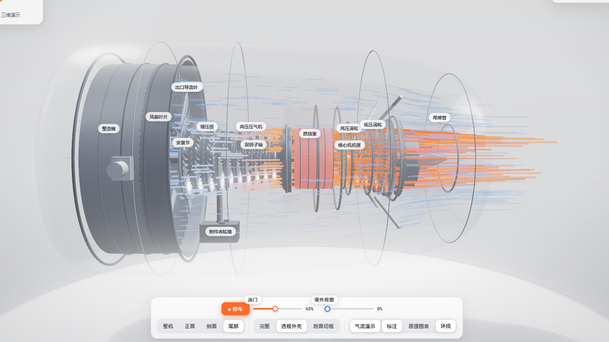
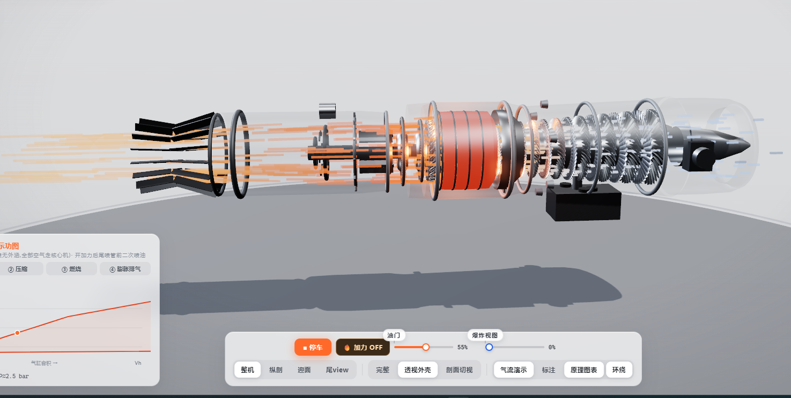
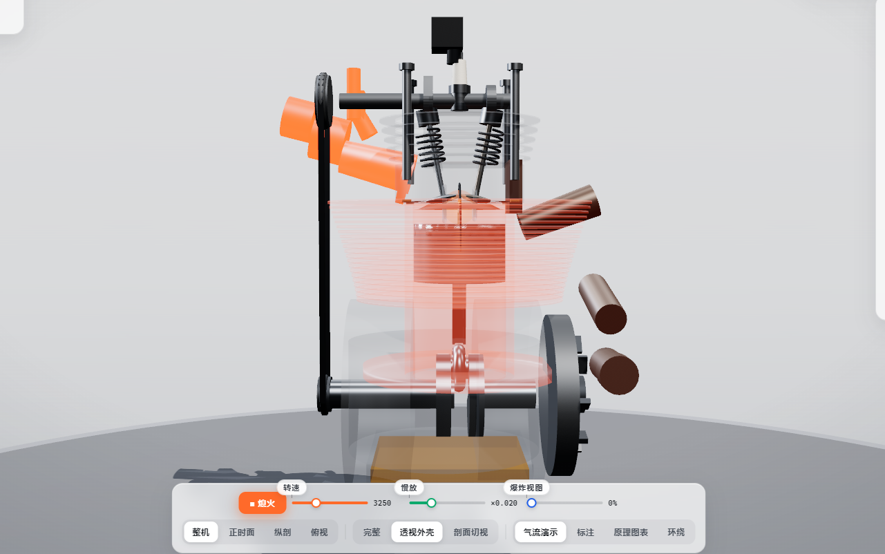
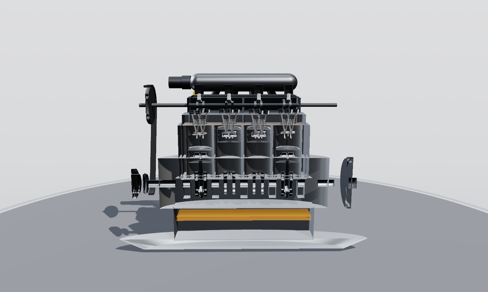

# 航空发动机 & 活塞发动机 · 交互式 3D 解剖系列

用 Three.js **纯代码程序化建模**的三台发动机,零外部模型资源,单文件实现。
支持 360° 旋转、剖面切视、透视外壳、爆炸视图、气流流线演示、P-V / 布雷顿循环原理图表,
以及每个部件的中文讲解。

## 预览

### 01 · 涡扇发动机 Turbofan —— `main` 分支(本分支)
高涵道比双转子:22 片宽弦风扇 + 增压级 + 高压压气机 + 环形燃烧室 + 双级涡轮 + 大短舱。
透视外壳下的内外涵气流演示 👇

👉 分支:[`main`](https://github.com/peter-pan-x/turbofan-engine/tree/main)(本页)

### 02 · 涡喷发动机 Turbojet —— `turbojet-engine` 分支
带**加力燃烧室**的单转子涡喷:8 级轴流压气机、两级涡轮、V 形火焰稳定器、
16 组可调尾喷口,开加力后喷口张开、尾焰出现激波菱形 👇

👉 分支:[`turbojet-engine`](https://github.com/peter-pan-x/turbofan-engine/tree/turbojet-engine)

### 03 · 单缸汽油发动机 Single-Cylinder —— `single-cylinder` 分支
四冲程 OHC 单缸机:真实曲柄连杆运动学、气门升程曲线、点火提前角、
P-V 示功图与慢放观察 👇

👉 分支:[`single-cylinder`](https://github.com/peter-pan-x/turbofan-engine/tree/single-cylinder)

### 04 · 直列四缸汽油发动机 Inline-4 —— `four-cylinder-engine` 分支
2.0L DOHC 16V:平面曲轴 0°-180°-180°-0°,发火顺序 1-3-4-2,正时皮带 2:1,
纵剖视角同时看到四套活塞连杆的不同冲程 👇

👉 分支:[`four-cylinder-engine`](https://github.com/peter-pan-x/turbofan-engine/tree/four-cylinder-engine)

## 如何运行

每个分支 / 目录里只有一个 `index.html`:

- 直接**双击打开**(需联网加载 Three.js CDN),或
- 任意静态服务器托管后访问(如 `python -m http.server 8000`)。

操作:拖动旋转 · 滚轮缩放 · 右键平移 · 点击部件查看中文讲解;
快捷键:`空格` 起动/停车 · `C` 剖面 · `L` 标注。

## 分支导航

| 分支 | 发动机 | 特色 |
|---|---|---|
| `main` | 涡扇 Turbofan | 大涵道比 · 双转子 · 内外涵气流 |
| `turbojet-engine` | 涡喷 Turbojet | 加力燃烧室 · 可调喷口 · 激波菱形 |
| `single-cylinder` | 单缸机 Single-Cylinder | 曲柄连杆运动学 · 示功图 · 慢放 |
| `four-cylinder-engine` | 四缸机 Inline-4 | 平面曲轴 · 发火顺序 1-3-4-2 · DOHC 16V |
